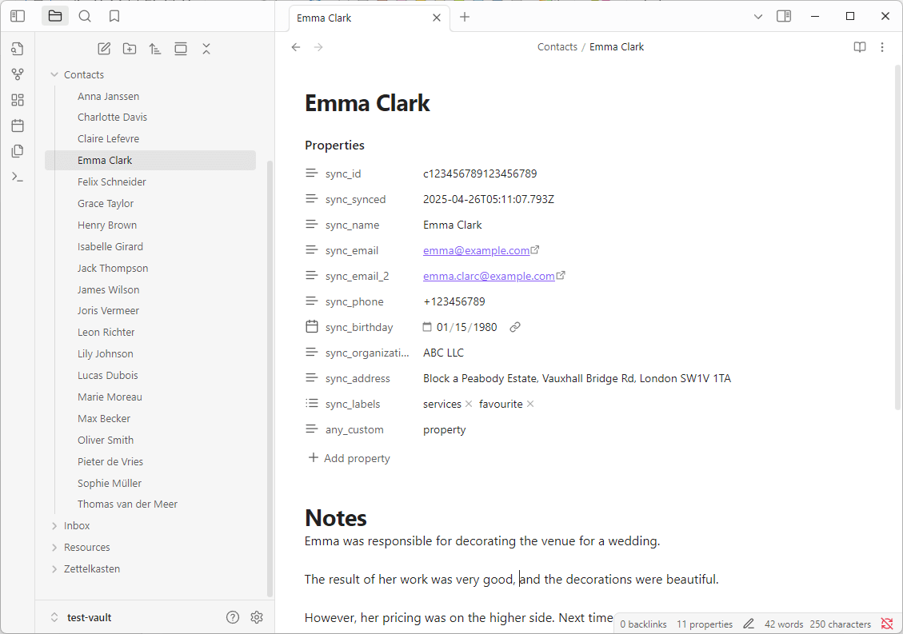

# 🧩 Google Contacts Sync

Synchronize your Google contacts directly into Obsidian!  
Each contact becomes a separate note with YAML frontmatter for metadata and free-form text for your notes.

---

## ⚙️ Features

- 🔄 Synchronize Google contacts into your Obsidian vault

- 🗂 Configurable folder for storing contact notes

- ✏️ Customizable note template (under the metadata block)

- 🏷 Filter by Google contact label (e.g. only sync contacts tagged with `obsidian`)

- 📛 Filename prefix support (e.g. `p Ivan Ivanov.md`)

- 🧩 Customizable prefix for metadata keys (e.g. `s_name_1`, `s_email_1`)

- 📇 Supports multiple names, emails, phone numbers, birthdays, addresses, organizations, job titles, labels

## 📸 Screenshots




---

## 📦 Installing into Obsidian

1. Open your Obsidian vault

2. Go to Settings → Community plugins

3. Turn Safe mode → OFF

4. Click Browse and search for `Google Contacts`

5. Click Install, then Enable the plugin

## 🔐 Google Authorization

1. Go to the plugin settings inside Obsidian.

2. Fill in:

- Client ID

- Client Secret
(see instructions below for how to obtain these)

3. Click the "Login to Google" button.

4. Follow the link, log in with your Google account, and copy the authorization code.

5. Paste the code into the prompt in Obsidian.
The plugin will automatically save the access and refresh tokens.

## 🚀 How to Use

1. Open the command palette (Ctrl+P or Cmd+P)

2. Run the command: Google Contacts: Sync


## 🔁 Sync Algorithm

- Only notes within the specified folder are used for syncing contacts.
    
- Each contact is matched using its `id` stored in the YAML frontmatter.
    
- If a contact already exists (by `id`), the plugin updates only the frontmatter. Existing user-defined frontmatter properties and free-text content below the frontmatter are preserved and **never overwritten**.
    
- If there is more than one piece of information for a given property (e.g., multiple phone numbers or multiple birthdays), the plugin appends a number to the property name. For example:
    
```yaml
phone: +123456789
phone_2: +987654321
birthday: 1990-05-10
birthday_2: 1992-07-15
```

- You can define a **prefix** for the property names in the frontmatter. This allows you to avoid conflicts with existing properties and to better organize your notes. For example, if the prefix is `sync_`, the properties will be stored as:

```yaml
sync_id: CONTACT_ID
sync_name: Full Name
sync_email: email@example.com
sync_phone: +123456789
sync_birthday: 1990-05-10
sync_synced: 2025-04-19T12:34:56.789Z
```

- If no matching file exists, a new note is created with the following structure:
    
```yaml
---
id: CONTACT_ID
name: Full Name
email: email@example.com
phone: +123456789
synced: 2025-04-19T12:34:56.789Z
---

# Notes  

You can write anything here — this section is safe.
```

- The `synced` date uses **UTC (Coordinated Universal Time)** to ensure correct synchronization across time zones.
    
- The plugin only updates properties related to the contact (such as `name`, `email`, `phone`, etc.). Any custom properties created by the user will **remain untouched**.
    
- If auto-syncing fails (e.g., due to a lack of internet connection), the next attempt will only occur during the next scheduled auto-sync. **No retries will be attempted** in between.

- If a sync label is configured, only contacts with that label will be synchronized. Contacts without the specified label will be ignored during the sync process.

## 🔐 How to Get a Google Client ID and Secret
To sync your contacts, you’ll need a valid Google Access Token that grants access to the People API.

### 1. Set up Google Cloud
Go to https://console.cloud.google.com

Create a new project (or select an existing one)

### 2. Enable People API
Navigate to: API & Services → Library

Search for People API

Click Enable

### 3. Create OAuth 2.0 Credentials
Go to: API & Services → Credentials

Click "Create Credentials → OAuth client ID"

If prompted, configure the OAuth consent screen (you can use testing mode)

For application type, select: Desktop App

Copy your Client ID and Client Secret

## 🔧 Build Instructions

To build the plugin:

1. Clone or download the repository

2. Install dependencies:

   ```bash
   npm install
   ```

3. Build the plugin using Rollup:   

   ```bash
   npm run build
   ```

### 📦 Installing your build into Obsidian

1. Open your Obsidian vault

2. Go to .obsidian/plugins/ and create a folder, e.g. google-contacts-sync

3. Copy the following files into that folder:

```
google-contacts-sync/
├── main.js
└── manifest.json
```

4. In Obsidian:

- Go to Settings → Community Plugins

- Enable Safe Mode → OFF

- Click "Load community plugins"

- Enable google-contacts-sync
